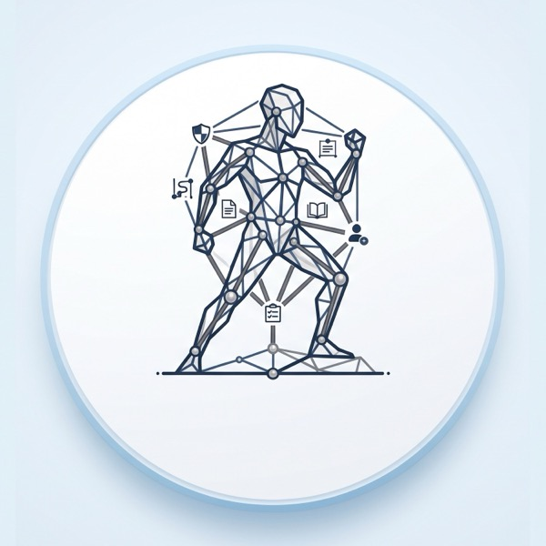

<h1> LAYUP</h1>

*Evidence-based discipline setup and delivery governance for multi-agent software work.*

**What this is.** LAYUP is a software product under construction. Its problem
statement is the approved PSB, stored as the raw fact
[`F-0001`](docs/facts/F-0001-layup-problem-statement-brief.md). LAYUP obeys the
same discipline that it will set up for other projects: this repository is an
Armature project, a one-time copy of the Armature kit pinned at commit `a959655`
([`docs/setup/armature.pin`](docs/setup/armature.pin),
[ADR-0009](docs/adr/0009-pin-armature-at-a-recorded-commit.md)), with no upstream
link. The `layup` command so far prints its version and checks a problem
statement for gaps (`layup psb check FILE`); the stack is Go
([ADR-0010](docs/adr/0010-use-go-as-the-technology-stack.md)), and the core engine
will be one Go command-line program over files in the repository
([ADR-0011](docs/adr/0011-structure-the-core-engine-as-a-go-cli-over-repository-files.md)).

## Start here

1. **[`docs/onboarding-for-engineers.md`](docs/onboarding-for-engineers.md)** — read this first
   (~30 min). It states the [Problem statement](docs/onboarding-for-engineers.md#1-problem-statement)
   and teaches the project's vocabulary.
2. **[`docs/engineering-discipline.md`](docs/engineering-discipline.md)** — how we work: the
   quality gate every substantive task passes, plus branches, tests, reviews, and
   ADRs. Read before your first commit.
3. **[`AGENTS.md`](AGENTS.md)** — if you are a coding agent, start here instead. It
   summarises [`docs/engineering-discipline.md`](docs/engineering-discipline.md)
   and [`docs/issue-workflow.md`](docs/issue-workflow.md), and indexes the rest.
   The long documents stay authoritative.

## What's inside

| Piece | What it holds |
|-------|---------------|
| [`AGENTS.md`](AGENTS.md) | The agent entry point: the quality gate, the checks, a pointer to the R1–R13 rules, and which document is authoritative for each — in under 1,500 words. |
| [`CLAUDE.md`](CLAUDE.md) | One line, `@AGENTS.md`, so Claude Code loads the same guide. No second copy to drift. |
| [`docs/agents/`](docs/agents/) | What the entry points are and what they may not become ([ADR-0004](docs/adr/0004-ship-agent-entry-points.md)). |
| [`docs/onboarding-for-engineers.md`](docs/onboarding-for-engineers.md) | The first door: the problem statement and a domain crash course. |
| [`docs/engineering-discipline.md`](docs/engineering-discipline.md) | The quality gate, the reusable solution-selection standard, and every working practice. |
| [`docs/issue-workflow.md`](docs/issue-workflow.md) | The issue-first workflow (R1–R13): the ticket policy the gate assumes. |
| [`docs/glossary.md`](docs/glossary.md) | The shared vocabulary the other docs assume. |
| [`docs/guardrails.md`](docs/guardrails.md) | Known pitfalls, pre-registered pass/fail rules, and validation. |
| [`docs/setup/`](docs/setup/) | The Armature pin, the setup record with the evidence for each setup value, the open gaps, the branch-protection body, and `setup-check.sh`, which proves the setup. |
| [`docs/adr/`](docs/adr/) | Architecture Decision Records that constitute a project — the *why* behind structural choices — plus [`adr-lint.sh`](docs/adr/adr-lint.sh), the discipline test that keeps them honest. Armature's own past governance decisions were archived under `docs/decisions/` in the kit; this repository deleted that directory (kit step 4). |
| [`docs/facts/`](docs/facts/) | Raw facts kept as immutable evidence — the PSB (`F-0001`) and the vision brief (`F-0002`, a solution document) — and the citation convention that derives requirements from them. |
| [`docs/prd/`](docs/prd/) | Product Requirements Documents derived from the facts, plus [`prd-lint.sh`](docs/prd/prd-lint.sh), the discipline test that keeps them honest. |
| [`docs/tests/`](docs/tests/) | The testing conventions — the test levels, a pattern per level, the security, scaling, and Definition-of-Done checklists, and test-to-requirement traceability — plus [`run-discipline-tests.sh`](docs/tests/run-discipline-tests.sh), which tests the kit's own linters against fixtures. |
| [`tests/`](tests/) | Cross-package end-to-end fixtures; Go unit and integration tests sit beside the code. Empty so far (the first e2e test sits beside its package), kept in git by a `.gitkeep`. |
| [`docs/tasks/`](docs/tasks/) | The task index — [`backlog.md`](docs/tasks/backlog.md) and [`completed.md`](docs/tasks/completed.md). |
| [`.githooks/`](.githooks/) | Git hooks that enforce the cheap gate locally — a commit-message check and a pre-commit runner. Install with `sh .githooks/install.sh`. |
| [`.gitattributes`](.gitattributes) | **Copy this one.** It keeps the kit's scripts and hooks at line-feed endings, without which none of them runs on a Windows checkout, and pins the handful of fixtures whose Windows endings *are* the assertion. Leave it behind and the gate is either unrunnable or quietly testing nothing. |
| [`docs/ci/`](docs/ci/) | Optional CI templates (GitHub Actions and GitLab CI) that run the same gate on every PR. Inert until you copy one into place. |
| [`docs/templates/`](docs/templates/) | Optional, inert GitHub/GitLab issue and PR templates that embody the issue-first workflow. Inert until you copy them into place. |

## How this repository was set up

By hand, one time, on 2026-09-23, under parent issue
[#1](https://github.com/pharzam/layup/issues/1). The kit's own adoption steps were
followed; each filled value has its evidence in
[`docs/setup/record-T-n1hp.md`](docs/setup/record-T-n1hp.md), and each value with
no source is an open gap in [`docs/setup/open-gaps.tsv`](docs/setup/open-gaps.tsv).
`sh docs/setup/setup-check.sh` proves the setup and runs in CI as a required
check. This manual run is the baseline for LAYUP's own automated setup.
